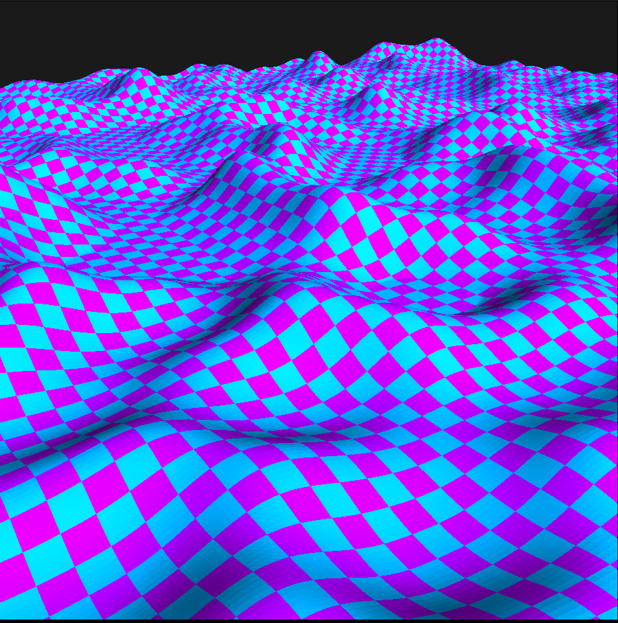

# Terrain Generation based on Perlin Noise
This is a small demo that generates a terrain based on perlin noise and
renders it using OpenGL3.0

* `perlin.c` perlin noise generation.
* `math.c` linear algebra.
* ` main.c` rendering, mesh generation, shader loading.
* `simple.frag` very simple pong lighting and checker board pattern generation.

 Notes:
    * You need GLFW and GLEW to compile this.
    * The program has to be run inside the main folder for it to be able to read
      shader source code.

Sample Image:

